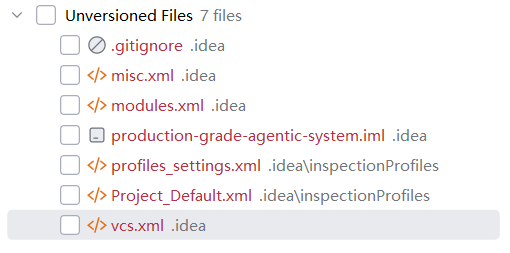

因为它们还没有被 Git 纳入版本控制，所以在 Git 里显示为 unversioned files（未跟踪文件）。
你这张图里的意思
这些文件都在 .idea/ 目录下，通常是 JetBrains IDE（比如 PyCharm / IntelliJ）自动生成的本地配置，例如：
misc.xml
modules.xml
vcs.xml
inspectionProfiles/*
production-grade-agentic-system.iml
它们之所以是 unversioned，通常有两种原因：
这些文件刚生成，还没 add/commit
项目的 .gitignore 没有把它们加入跟踪，Git 也就不会管理它们
 
什么叫 unversioned
Git 里文件状态大概有这些：
tracked / versioned：已经被 Git 管理了
untracked / unversioned：文件存在，但 Git 还不认识它
modified：已跟踪文件被改过了
deleted：已跟踪文件被删了
你现在看到的是第二种。
 
这些 .idea 文件要不要提交？
一般来说：
不建议提交的
大多数 .idea 下的文件属于个人 IDE 配置，通常不建议提交，比如：
misc.xml
modules.xml
vcs.xml
*.iml
有时可以提交的
如果团队想共享某些 IDE 设置，比如：
inspectionProfiles/
部分代码风格配置
那可以选择性提交，但这不是必须的。
 
你现在这种情况一般怎么处理
如果你不想把这些 IDE 配置放进仓库，通常做法是：
把 .idea/ 加进 .gitignore
只保留少量团队需要共享的配置文件
 
简单判断
你自己本机开发：这些 unversioned 很正常，通常不用管
准备提交代码：一般不建议把 .idea 这些都提交，除非团队明确要求
如果你愿意，我可以下一步直接帮你判断：
这几个 .idea 文件哪些该忽略、哪些可以提交。